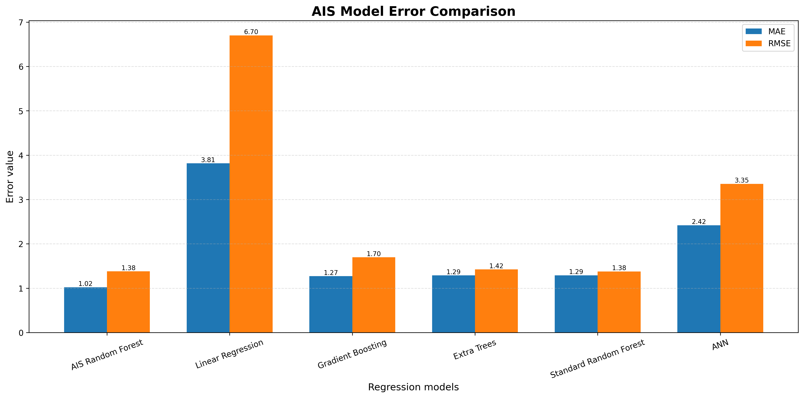

# Smart Rainfall Pattern Analysis and Localized Rainfall Prediction System using Particle Swarm Optimization (PSO)

An intelligent machine learning system that analyzes historical rainfall patterns and predicts future localized rainfall using **Particle Swarm Optimization (PSO)** for Random Forest hyperparameter optimization and an Artificial Neural Network (ANN) for comparison.
---

# Project Overview

Rainfall forecasting plays an important role in agriculture, water resource management, disaster preparedness, irrigation planning, and environmental monitoring. Traditional prediction techniques often struggle to capture complex nonlinear rainfall relationships.

This project proposes a **Smart Rainfall Pattern Analysis and Localized Rainfall Prediction System** that combines:

- Particle Swarm Optimization (PSO)
- Random Forest Regression
- Artificial Neural Network (ANN)
- Feature Engineering
- Historical Rainfall Analysis

to improve rainfall prediction accuracy.

The PSO algorithm automatically searches for the optimal Random Forest hyperparameters, leading to better prediction performance than manually selected parameters.

---

# Objectives

- Analyze historical rainfall records.
- Predict rainfall for future dates.
- Optimize Random Forest using PSO.
- Compare multiple regression algorithms.
- Generate graphical visualizations.
- Save trained models for future prediction.
- Export prediction reports.

---

# Dataset

Dataset Used:

```
rainfall_0.csv
```

The dataset contains

- District
- Taluka
- Circle
- Historical rainfall observations
- Target rainfall value (11-Sep)

Example Features

```
District
Taluka
Circle
01-Aug
02-Aug
03-Aug
...
10-Sep
```

Target

```
11-Sep
```

---

# Machine Learning Workflow

```
Dataset
      │
      ▼
Data Cleaning
      │
      ▼
Missing Value Handling
      │
      ▼
Categorical Encoding
      │
      ▼
Feature Scaling
      │
      ▼
Train-Test Split
      │
      ▼
Particle Swarm Optimization
      │
      ▼
Optimized Random Forest
      │
      ▼
Prediction
      │
      ▼
Performance Evaluation
      │
      ▼
Graphs + CSV + Saved Models
```

---

# Algorithms Used

## Optimization Algorithm

- Particle Swarm Optimization (PSO)

---

## Machine Learning Models

- Optimized Random Forest
- Artificial Neural Network
- Gradient Boosting Regressor
- Extra Trees Regressor
- Linear Regression

---

# Particle Swarm Optimization

The Particle Swarm Optimization algorithm searches for the best Random Forest parameters.

Optimized Parameters

- Number of Trees
- Maximum Tree Depth
- Minimum Samples Split
- Minimum Samples Leaf
- Maximum Features
- Bootstrap Option

The objective is minimizing

```
Cross Validation RMSE
```

---

## Visualization

> **Model Comparison Graph**



---

# Artificial Neural Network

The project also trains a deep neural network consisting of

- Dense Layers
- Batch Normalization
- Dropout
- Adam Optimizer
- Early Stopping
- Reduce Learning Rate

The ANN model is exported as

```
pso_rainfall_ann_model.h5
```

---

# Features Used

Categorical Features

- District
- Taluka
- Circle

Numerical Features

- Daily rainfall values
- Historical rainfall observations

Target

```
11-Sep Rainfall
```

---

# Evaluation Metrics

The following regression metrics are calculated.

- Mean Absolute Error (MAE)
- Mean Squared Error (MSE)
- Root Mean Squared Error (RMSE)
- R² Score

---

# Graphs Generated

## Accuracy Graph

Shows R² scores of all regression models.

```
pso_accuracy_graph.png
```

---

## Comparison Graph

Compares MAE and RMSE across all models.

```
pso_comparison_graph.png
```

---

## Heatmap

Displays rainfall feature correlation.

```
pso_heatmap.png
```

---

## Result Graph

Actual vs Predicted rainfall on testing data.

```
pso_result_graph.png
```

---

## Prediction Graph

Predictions for all available locations.

```
pso_prediction_graph.png
```

---

## PSO Optimization Graph

Shows optimization progress across iterations.

```
pso_optimization_graph.png
```

---

## ANN Training Graph

Training vs Validation Loss.

```
pso_ann_training_history.png
```

---

## Feature Importance

Top Random Forest feature importance.

```
pso_feature_importance.png
```

---

# Files Generated

## Model Files

```
pso_rainfall_ann_model.h5

pso_rainfall_model.pkl

pso_rainfall_preprocessor.pkl
```

---

## Configuration Files

```
pso_rainfall_config.yaml

pso_rainfall_results.json
```

---

## CSV Files

```
pso_result.csv

pso_prediction.csv

pso_optimization_history.csv

pso_model_comparison.csv

pso_feature_importance.csv
```

---

## Images

```
pso_accuracy_graph.png

pso_comparison_graph.png

pso_heatmap.png

pso_result_graph.png

pso_prediction_graph.png

pso_optimization_graph.png

pso_ann_training_history.png

pso_feature_importance.png
```

---

# Project Directory

```
Smart Rainfall Pattern Analysis and Localized Rainfall Prediction System
│
├── rainfall_0.csv
│
├── pso_rainfall_ann_model.h5
├── pso_rainfall_model.pkl
├── pso_rainfall_preprocessor.pkl
│
├── pso_rainfall_config.yaml
├── pso_rainfall_results.json
│
├── pso_result.csv
├── pso_prediction.csv
├── pso_optimization_history.csv
├── pso_model_comparison.csv
├── pso_feature_importance.csv
│
├── pso_accuracy_graph.png
├── pso_comparison_graph.png
├── pso_heatmap.png
├── pso_result_graph.png
├── pso_prediction_graph.png
├── pso_optimization_graph.png
├── pso_ann_training_history.png
└── pso_feature_importance.png
```

---

# Required Libraries

Install dependencies using:

```bash
pip install numpy
pip install pandas
pip install matplotlib
pip install scikit-learn
pip install tensorflow
pip install pyyaml
pip install joblib
```

or

```bash
pip install numpy pandas matplotlib scikit-learn tensorflow pyyaml joblib
```

---

# Running the Project

Run the Python file

```bash
python pso_rainfall_prediction_fixed.py
```

The program automatically

- Loads dataset
- Cleans data
- Preprocesses features
- Performs PSO optimization
- Trains Random Forest
- Trains ANN
- Compares multiple regression models
- Generates predictions
- Saves trained models
- Exports CSV files
- Creates graphs
- Saves YAML configuration
- Saves JSON report

---

# Applications

- Rainfall Forecasting
- Smart Agriculture
- Flood Prediction
- Water Resource Planning
- Crop Management
- Weather Analytics
- Environmental Monitoring
- Decision Support Systems

---

# Advantages

- Automatic hyperparameter optimization
- High prediction accuracy
- Supports nonlinear rainfall relationships
- Model persistence
- Comprehensive visualization
- Easy deployment
- Reproducible workflow
- Extendable architecture

---

# Future Enhancements

- LSTM-based rainfall forecasting
- Transformer models
- Real-time weather API integration
- Satellite rainfall imagery
- GIS visualization
- Interactive dashboard
- Mobile application
- Cloud deployment
- IoT weather station integration

---

# Conclusion

The **Smart Rainfall Pattern Analysis and Localized Rainfall Prediction System using Particle Swarm Optimization (PSO)** provides an efficient approach for localized rainfall prediction by combining machine learning with evolutionary optimization. The PSO algorithm identifies optimal Random Forest hyperparameters, improving predictive performance over manually tuned models. The project also offers rich visualizations, multiple regression model comparisons, model persistence, and exportable reports, making it suitable for agricultural planning, environmental monitoring, and weather decision-support applications.
